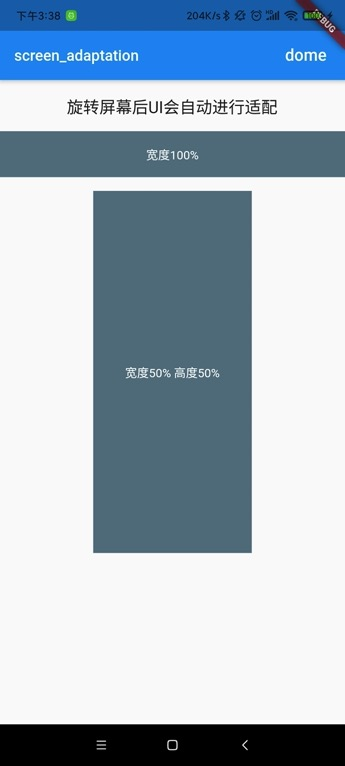
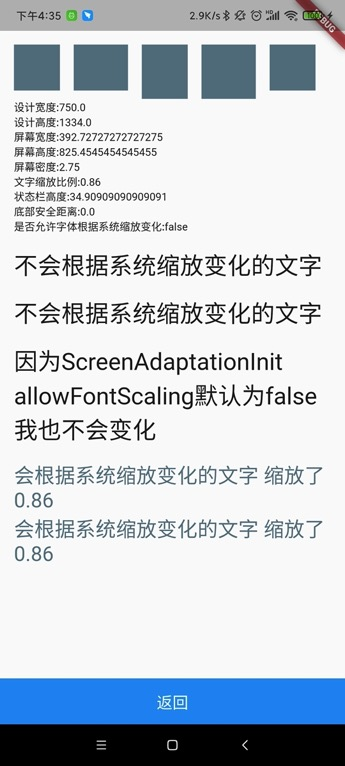

# screen_adaptation

 *flutter 屏幕适配方案*
 

 
 
> 注意事项 最好 dart sdk>=2.6 [没有使用低版本测试如有问题请反馈]()
 
###配置pubspec.yaml
```yaml
dependencies:
  screen_adaptation: ^{latest version}
```
###使用的时候引入
```dart
import 'package:screen_adaptation/screen_adaptation.dart';
```
###使用方法
```dart
class MyApp extends StatelessWidget {
  // This widget is the root of your application.
  @override
  Widget build(BuildContext context) {
    /// [OrientationBuilder] 不需要旋转屏幕方向UI可以省略 直接返回MaterialApp
    return OrientationBuilder(
        builder: (BuildContext context, Orientation orientation) => MaterialApp(
          title: 'Flutter Demo',
          theme: ThemeData(
            primarySwatch: Colors.blue,
          ),
          home: MyHomePage(),
          builder: (BuildContext context, Widget child) {
            return ScreenAdaptationInit(
                allowFontScaling: true,
                size: Size(750, 1334),
                child: child);
          },
        ));
  }
}
```
> 如果需要旋转的屏幕的时候自动刷新UI 需要在最外层增加 OrientationBuilder 不需要请忽略 
###参数说明
- ScreenAdaptationInit

|属性|类型|默认值|描述|
|:---|:---|:---|:---|
|size|Size|Size(750, 1334)|设计稿中设备的尺寸|
|landscapeSize|Size|null|横屏UI设计图尺寸 可不传 默认为 竖屏[size]尺寸反转 [landscapeSize.width]为[size.height] [landscapeSize.height]为[size.width]|
|allowFontScaling|bool|false|字体是否根据系统缩放比例变化|

- ScreenAdaptationUtil

*这里使用screenAdaptationUtil 代替 ScreenAdaptationUtil.getInstance()*

|属性|类型|使用方式|描述|
|:---|:---|:---|:---|
|width|double|screenAdaptationUtil.width|设计宽度
|height|double|screenAdaptationUtil.height|设计高度
|screenWidth|double|screenAdaptationUtil.screenWidth|屏幕宽度
|screenHeight|double|screenAdaptationUtil.screenHeight|屏幕高度
|pixelRatio|double|screenAdaptationUtil.pixelRatio|屏幕密度
|textScaleFactor|double|screenAdaptationUtil.textScaleFactor|系统字体缩放比例
|statusBarHeight|double|screenAdaptationUtil.statusBarHeight|状态栏高度
|bottomBarHeight|double|screenAdaptationUtil.bottomBarHeight|底部安全距离
|allowFontScaling|bool|screenAdaptationUtil.allowFontScaling|是否允许字体根据系统缩放 
|setWidth|Function|screenAdaptationUtil.setWidth(num)或者[num].w|根据宽度进行适配 
|setHeight|Function|screenAdaptationUtil.setHeight(num)或者[num].h|根据高度进行适配 
|setSp|Function|screenAdaptationUtil.setSp(fontSize,allowFontScaling:true/false)或者[fontSize].s [fontSize].st [fontSize].sf|文字适配  allowFontScaling 是否允许系统缩放
|setAutomatic|Function|screenAdaptationUtil.setAutomatic(num)或者[num].r|根据宽高比例较小的适配 

###例子
```dart
class DomePage extends StatelessWidget {
  @override
  Widget build(BuildContext context) {
    return Scaffold(
      body: SingleChildScrollView(
        padding: EdgeInsets.only(
            top: ScreenAdaptationUtil.getInstance().statusBarHeight + 30.w,
            left: 30.w,
            right: 30.w,
            bottom: 30.w),
        child: Column(
          crossAxisAlignment: CrossAxisAlignment.start,
          children: [
            Wrap(
              spacing: 30.w,
              runSpacing: 30.w,
              children: [
                Container(
                  width: ScreenAdaptationUtil.getInstance().setWidth(100),
                  height: ScreenAdaptationUtil.getInstance().setWidth(100),
                  color: Colors.blueGrey,
                  alignment: Alignment.center,
                ),
                Container(
                  width: 100.h,
                  height: 100.w,
                  color: Colors.blueGrey,
                  alignment: Alignment.center,
                ),
                Container(
                  width: 100.w,
                  height: 100.h,
                  color: Colors.blueGrey,
                  alignment: Alignment.center,
                ),
                Container(
                  width: 100.h,
                  height: 100.h,
                  color: Colors.blueGrey,
                  alignment: Alignment.center,
                ),
                Container(
                  width: 100.r,
                  height: 100.r,
                  color: Colors.blueGrey,
                  alignment: Alignment.center,
                ),
              ],
            ),
            Container(
              child: Text('设计宽度:${ScreenAdaptationUtil.getInstance().width}'),
            ),
            Container(
              child: Text('设计高度:${ScreenAdaptationUtil.getInstance().height}'),
            ),
            Container(
              child: Text(
                  '屏幕宽度:${ScreenAdaptationUtil.getInstance().screenWidth}'),
            ),
            Container(
              child: Text(
                  '屏幕高度:${ScreenAdaptationUtil.getInstance().screenHeight}'),
            ),
            Container(
              child:
                  Text('屏幕密度:${ScreenAdaptationUtil.getInstance().pixelRatio}'),
            ),
            Container(
              child: Text(
                  '文字缩放比例:${ScreenAdaptationUtil.getInstance().textScaleFactor}'),
            ),
            Container(
              child: Text(
                  '状态栏高度:${ScreenAdaptationUtil.getInstance().statusBarHeight}'),
            ),
            Container(
              child: Text(
                  '底部安全距离:${ScreenAdaptationUtil.getInstance().bottomBarHeight}'),
            ),
            Container(
              child: Text(
                  '是否允许字体根据系统缩放变化:${ScreenAdaptationUtil.getInstance().allowFontScaling}'),
            ),
            Container(
              margin: EdgeInsets.only(top: 30.w),
              child: Text(
                '不会根据系统缩放变化的文字',
                style: TextStyle(
                    fontSize: ScreenAdaptationUtil.getInstance()
                        .setSp(60, allowFontScaling: false)),
              ),
            ),
            Container(
              margin: EdgeInsets.only(top: 30.w),
              child: Text(
                '不会根据系统缩放变化的文字',
                style: TextStyle(fontSize: 60.sf),
              ),
            ),
            Container(
              margin: EdgeInsets.symmetric(vertical: 30.w),
              child: Text(
                '因为ScreenAdaptationInit allowFontScaling默认为false 我也不会变化',
                style: TextStyle(fontSize: 60.s),
              ),
            ),
            Container(
              child: Text(
                '会根据系统缩放变化的文字 缩放了 ${ScreenAdaptationUtil.getInstance().textScaleFactor}',
                style: TextStyle(
                    color: Colors.blueGrey,
                    fontSize: ScreenAdaptationUtil.getInstance()
                        .setSp(60, allowFontScaling: true)),
              ),
            ),
            Container(
              child: Text(
                '会根据系统缩放变化的文字 缩放了 ${ScreenAdaptationUtil.getInstance().textScaleFactor}',
                style: TextStyle(color: Colors.blueGrey, fontSize: 60.st),
              ),
            ),
          ],
        ),
      ), // This trailing comma makes auto-formatting nicer for build methods.
    );
  }
}
```
